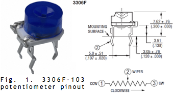
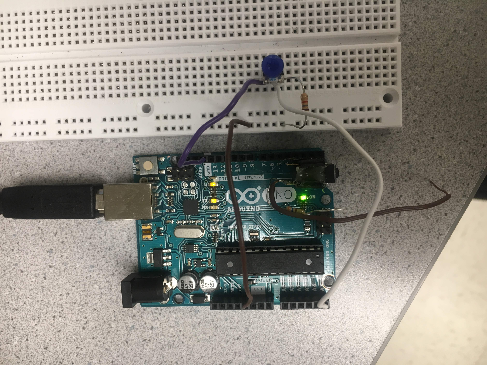
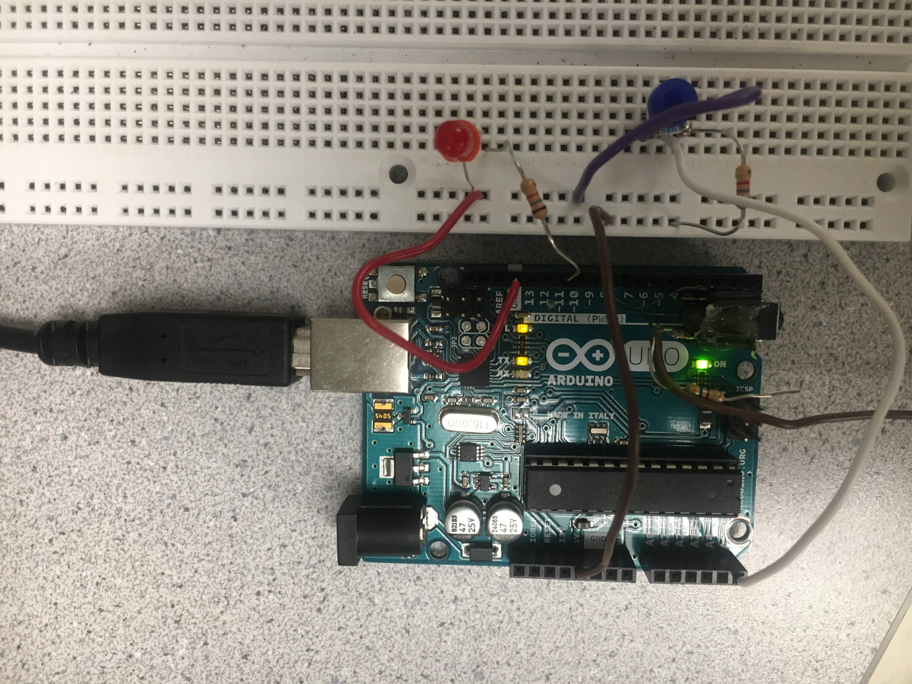

# Lab 1

[Home](https://ece3400team19.github.io/)


## Description

In this lab, we used the various functionalities of the Arduino Uno and the Arduino IDE, as well as the GitHub repository.
We brainstormed and constructed a simple functional Arduino program using multiple external components and the Arduino Uno.
We then put together our robot and had it perform a [simple autonomous task](#robot-demo).

## Materials

* 1 Arduino Uno (in the box)
* 1 USB A/B cable (in the box)
* 1 Continuous rotation servos
* 1 Pushbutton
* 1 LED (any color except IR!)
* 1 Potentiometer
* Several resistors (kΩ range)
* 1 Solderless breadboard

## Part 1 - Communicating between the Uno and Video

Our first task was to get the internal LED on the Arduino Uno to blink. In the Arduino IDE, we navigated to File > Examples > 1.Basics > Blink. This opened up the "Blink" example sketch. To program the Arduino, we first compiled the code by clicking the checkmark and then uploaded it by clicking on the right-pointing arrow. Once the code uploaded, the internal LED blinked on and off every second.

Blink sketch uploaded to the Arduino:
```
/*
  Blink

  Turns an LED on for one second, then off for one second, repeatedly.

  Most Arduinos have an on-board LED you can control. On the UNO, MEGA and ZERO
  it is attached to digital pin 13, on MKR1000 on pin 6. LED_BUILTIN is set to
  the correct LED pin independent of which board is used.
  If you want to know what pin the on-board LED is connected to on your Arduino
  model, check the Technical Specs of your board at:
  https://www.arduino.cc/en/Main/Products

  modified 8 May 2014
  by Scott Fitzgerald
  modified 2 Sep 2016
  by Arturo Guadalupi
  modified 8 Sep 2016
  by Colby Newman

  This example code is in the public domain.

  http://www.arduino.cc/en/Tutorial/Blink
*/

// the setup function runs once when you press reset or power the board
void setup() {
  // initialize digital pin LED_BUILTIN as an output.
  pinMode(LED_BUILTIN, OUTPUT);
}

// the loop function runs over and over again forever
void loop() {
  digitalWrite(LED_BUILTIN, HIGH);   // turn the LED on (HIGH is the voltage level)
  delay(1000);                       // wait for a second
  digitalWrite(LED_BUILTIN, LOW);    // turn the LED off by making the voltage LOW
  delay(1000);                       // wait for a second
}
```

Video of internal LED blinking once the Blink sketch was uploaded:

<video width="800" height="600" controls muted>
  <source src="blinking.MOV" type="video/mp4">
</video>

## Part 2 - Modifying the Blink sketch

Next, we needed to modify the Blink sketch to now make an external LED blink on and off every second. First let's start with connecting the LED to the Arduino. We placed our LED onto the breadboard, connecting the anode of the LED (the longer leg) to digital pin 12 on the Arduino with a wire, and the cathode (the shorter leg) to the GND (ground) pin on the Arduino with a wire. To prevent shorting out any pin on the board or any components themselves, we placed a 1.5 kΩ resistor in series with the LED before connecting it to digital pin 12. The only modification that needed to be made in the Blink sketch was changing LED_BUILTIN to 12, to denote digital pin 12 where the external LED was connected. This change was made both within void setup() and void loop().

Modified Blink sketch which blinks an external LED on and off  every second:
```
// the setup function runs once when you press reset or power the board
void setup() {
  // initialize digital pin 12, to which the external LED is connected, as an output.
  pinMode(12, OUTPUT);
}

// the loop function runs over and over again forever
void loop() {
  digitalWrite(12, HIGH); // turn the LED on (HIGH is the voltage level)
  delay(1000);            // wait for a second
  digitalWrite(12, LOW);  // turn the LED off by making the voltage LOW
  delay(1000);            // wait for a second
}
```


Video of external LED blinking once the modified Blink sketch was uploaded:
<video width="800" height="600" controls muted>
  <source src="externalLED.MOV" type="video/mp4">
</video>

## Part 3 - The Serial Monitor and the Analog Pins

 In this part of the lab, we utilized the Uno's analog pins. An analog pin only works as an INPUT, which removes the need to configure it as an INPUT within void setup(). We used a potentiometer to input a range of different analog voltages and then printed the values to the screen using the Serial Monitor. The potentiometer we used has three pins and a diagram can be seen below. The potentiometer was placed on the breadboard and its center pin was connected in series with a 1.5 kΩ resistor to analog pin A5 with a wire. Out of the remaining two pins, one was connected to GND on the Arduino and the remaining pin was connected to +5V. Since we used the Serial Monitor to print out voltage values, in void setup() we needed to set the rate at which data will be read in. We picked 9600 bps (bits per second) as it is a commonly used value. Again, analog pin A5 did not need to be set up as an input. Within void loop(), the analog voltage value of the potentiometer is read and then printed to the Serial Monitor. As the potentiometer knob is turned CCW (counter-clockwise) the input voltage decreases in value, whereas turning it CW increases the voltage.  

 Diagram of potentiometer connected to the Arduino Uno:

 

Code for inputting variable analog voltages using potentiometer:
```
 // create variable to refer to analog pin connection of the potentiometer
int pot = A5;

void setup() {
   // set data rate to 9600 bps (bits per second)
  Serial.begin(9600);
}

void loop() {
  // read the input analog voltage
  int analogValue = analogRead(pot);
  // print voltage value (on a new line) to Serial Monitor
  Serial.println(analogValue);
}

```
Photo of the potentiometer circuit:



\*HERE WE NEED TO DESCRIBE ADDING THE LED TO THIS CIRCUIT!!!\*

EXPLAIN THIS PART!!!

Code for adding LED to existing circuit:
ADD CODE HERE!!!

Photo of the Arduino setup with external LED and potentiometer.


Video of potentiometer-controlled LED output:
<video width="800" height="600" controls muted>
  <source src="externalLEDPOT.MOV" type="video/mp4">
</video>

## Part 4 - Using the Parallax servos

EXPLAIN THIS PART HERE!!!!

Video of Servo control:
<video width="800" height="600" controls muted>
  <source src="servo.MOV" type="video/mp4">
</video>

EXPLAIN ADDING THE POT!!!!

Video of potentiometer-controlled Servo control

<video width="800" height="600" controls muted>
  <source src="servoPot.MOV" type="video/mp4">
</video>


## Part 5 - Assembling the robot!

## Robot demo

EXPLAIN HERE!!!

<video width="800" height="600" controls muted>
  <source src="recorded-1535680951.MP4" type="video/mp4">
</video>


As with all projects, not everything goes perfectly at first! Here is a quick blooper:

<video width="800" height="600" controls muted>
  <source src="robot.mov" type="video/mp4">
</video>
