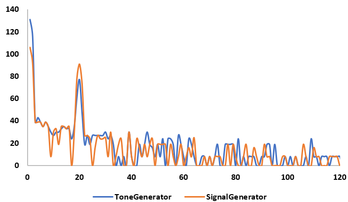
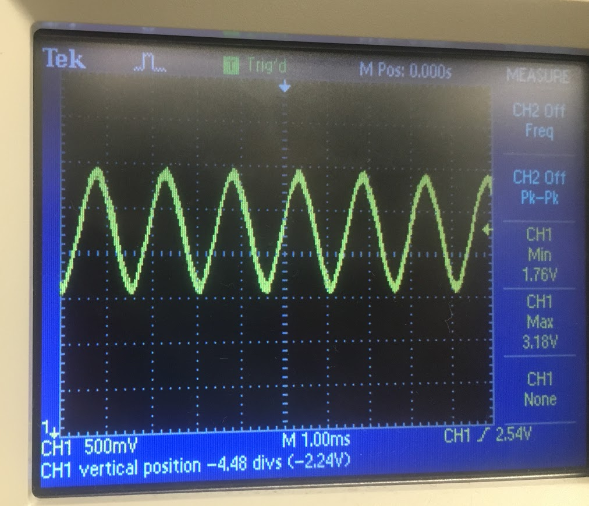

# Lab 2: Analog Circuitry and FFTs
[Home](https://ece3400team19.github.io/)

## Team Tasks
* Acoustic Team: Asena, Laasya, Nonso
* Optical Team: Cynthia, Robert

## Lab Description

In this lab, we added sensors and circuitry to our robot. The first was a microphone circuit that detects a 660Hz signal, this signal will be used to signify the start of the final competition. The second was an IR circuit that detects a 6.08kHz signal, a frequency that will be emitted by other robots during the competition. For both circuits, we need to be able to distinguish the desired frequency from decoys.

# Part 1: Acoustic

## Team Materials

* 1 Arduino Uno
* Electret microphone
* Capacitors and resistors of our choosing

We started the lab by assembling the microphone circuit suggested by the lab handout with a 1 µF capacitor and a 3.3 kΩ resistor:

 

We then used a tone generator app to play a 660Hz tone directly into the microphone at maximum volume, then checked the output of the circuit using the oscilloscope.

We were able to see our 660Hz signal on our oscilloscope with great difficulty, because the microphone also picked up all other noise in the room.
Then, we started looking at how to amplify our desired signal and squash other signals. We decided to feed the output of our microphone into an active band pass filter.
We started by building Team Alpha's circuit, and then adding an additional capacitor for more filtering.

Here is a picture of our circuit:

 

INSERT CIRCUIT DIAGRAM PIC

After building our circuit, we modified the example sketch from the FFT library, fft_adc_serial, to use analogRead(), the built-in method for reading an analog input, instead of running the ADC in free-running mode. The frequency 660Hz is in the 5th bin using the ADC, but in the 20th bin using analogRead() because analogRead() runs at a much slower sampling rate.

We first used the signal generator to put a 660Hz, 50mVpp with 25mV offset sine wave into our active band pass filter. We fed the output into pin A1 and ran our modified code for FFT. We got the output from the serial monitor and plotted it in Excel. We then played a 660Hz tone from the app Tone Generator directly into our microphone. We got the output and plotted in in Excel. The two plots are shown below:

 

 There is a peak of similar amplitude in the fifth pin from the 660Hz from the signal generator and the 660Hz from the tone generator app. This shows that our circuit is able to detect a 660Hz tone.

 We then played the 660Hz tone into our microphone again and checked the output using the oscilloscope.
 The setup and oscilloscope looked as follows:

# Part 2: Optical

## Team Materials
* 1 Arduino Uno
* IR transistor (OP598)
* 1 IR hat (given by TAs)
* 1 IR decoy
* Capacitors and resistors of our choosing
