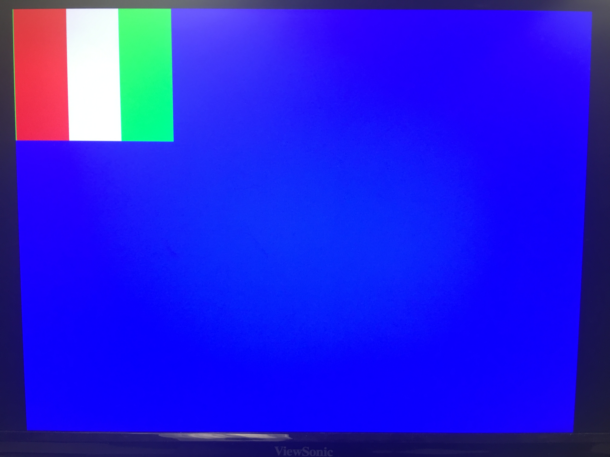

# Lab 4: FPGA and Vision
[Home](https://ece3400team19.github.io/)

## Team Tasks
* Arduino Team: Asena, Laasya
* FPGA Team: Cynthia, Robert, Nonso

## Lab Description
In this lab, we have split into two teams (Team Arduino and Team FPGA) to develop an FPGA module capable of detecting basic shapes from our camera input, and to pass this information onto our Arduino. This purpose of this would be to mount our device on our robot as to identify shapes on the walls of the maze.

## Arduino
2 points: Arduino-Camera communication (writing the correct registers)
3 points: Arduino-FPGA communication (communicating treasure/no treasure + shape and color)

## FPGA
2 points: Displaying the contents of an M9K block on the screen
3 points: Camera-FPGA communication (downsampling and storing in the M9K buffer)

## Integration
2 points: Displaying the test image from the camera on the screen
3 points: Color detection with the FPGA, camera, and Arduino
