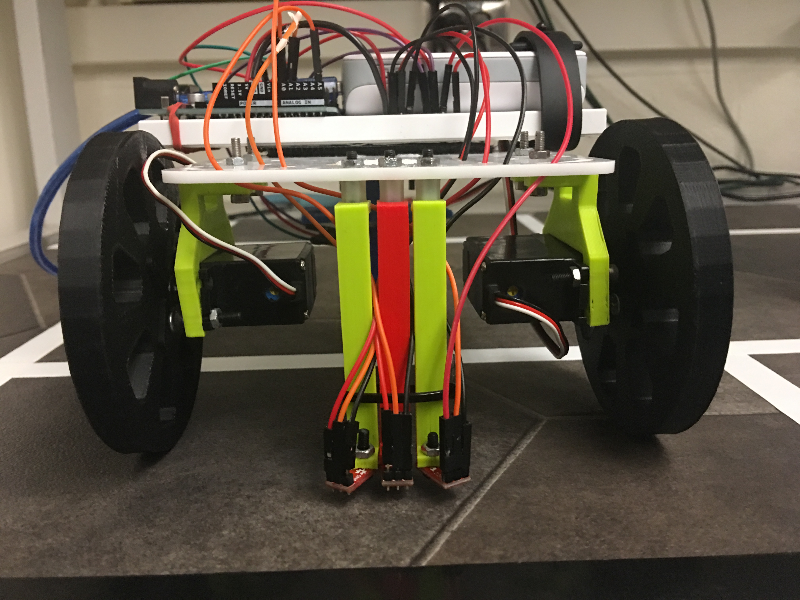

# Milestone 1: Following a Line
[Home](https://ece3400team19.github.io/)

## Team Tasks

## Milestone Description
The goal of this milestone was to get our robot to follow a line and traverse a grid in a figure eight

## Milestone Materials
3 line sensors (QRE1113)

## Part 1 - Hooking up the Line Sensors

There were two tasks included in milestone 1; following a line and driving in a figure eight.  Implicit in the second is the ability to turn either left or right.  To accomplish these tasks, we started with three line sensors.  They were mounted at the bottom of straight vertical pieces attached to the main chassis such that the sensors were as close to the ground as possible without dragging along the floor.  This proximity was necessary to get the most contrast we could between white and black.  

 
At first we had all three sensors facing parallel to the line side-by-side to use multiple low outputs (multiple sensors 'on the line') to aid in following the line.  However, we later settled on a method using a single sensor low to do line following, using the other two sensors only for course correction and detecting intersections.  To go along with this alternate implementation, we flared out the two sensors on the sides, aligning them away from the central sensor such that the distance between them was roughly equal to the width of the line for easy course correction.  

As we moved to the figure eight task, we decided to remount the sensors, putting them on the opposite side of the robot.  We kept the flared design from before for this remounting as well.  The final sensor position is shown below


## Part 2 - Following a Line
Once we completed the setup for the Line Sensors, we developed an algorithm to best help the robot find the white line, stay on it, and turn right or left at the perpendicular intersections. The pseudo-code for this is as follows:

Loop:
  If the middle line sensor detects a white line:
    the robot should go straight

  If the middle sensor does not detect the white line, but the right sensor does:
    the robot should turn clockwise until the middle line sensor returns to the line

  If the middle sensor does not detect the white line, but the left sensor does:
    the robot should turn counterclockwise until the middle line sensor returns to the line

  If all 3 line sensors detect a white line:
    the robot acknowledges that it's at an intersection
    the robot will either turn left or right (to be determined by the code implementer)

  Else:
    the robot should go straight until the middle sensor detects a line

This allowed the robot to find and remain on a line, even if it's starting position was not perfectly parallel with any of the white lines. The Arduino implementation of this code is provided below:

```
#include <Servo.h>

Servo left; //180 turns wheel backward
Servo right; //180 turns wheel forward

int leftPin = A0; //define left line sensor's pin
int middlePin = A5; //define middle line sensor's pin
int rightPin = A1; //define right line sensor's pin
int leftSensor; //stores left line sensor's value
int middleSensor; //stores middle line sensor's value
int rightSensor; //stores right line sensor's value
int leftSpeed; //stores value of left servo
int rightSpeed; //stores value of right servo
int numIntersections = 0; //counts number of turns completed


void setup() {
  Serial.begin(9600);
  //left servo is connected to digital pin 10
  left.attach(10);
  //right servo is connected to digital pin 5
  right.attach(5);
}

void loop() {
  //read line sensor values
  leftSensor = analogRead(leftPin);
  middleSensor = analogRead(middlePin);
  rightSensor = analogRead(rightPin);

  //all sensors are on the white line
  if (leftSensor < 800  && middleSensor < 800 && rightSensor < 800) {
    // AT AN INTERSECTION
    leftSpeed = 85;
    rightSpeed = 85;
    left.write(leftSpeed);
    right.write(rightSpeed);
    delay(400);
  }
  //middle sensor is on the white line
  else if (middleSensor < 800) {
    //GO STRAIGHT
    leftSpeed = 95;
    rightSpeed = 85;
    left.write(leftSpeed);
    right.write(rightSpeed);
  }
  //middle sensor is not on the white line
  //adjust to get robot moving straight on the line again
  else {
    //robot has veered to the right
    //left sensor is only on the white line
    if (leftSensor < 800){
      //TURN LEFT
      leftSpeed = 85;
      rightSpeed = 85;
    }
    //robot has veered to the left
    //right sensor is only on the white line
    if (rightSensor < 800){
      //TURN RIGHT
      leftSpeed = 95;
      rightSpeed = 95;
    }
    left.write(leftSpeed);
    right.write(rightSpeed);
  }
}
```

## Part 3 - Moving in a Figure Eight
 <iframe width="560" height="315" src="https://www.youtube.com/embed/7-ruKoju54E" frameborder="0" allow="autoplay; encrypted-media" allowfullscreen></iframe>

```
#include <Servo.h>

Servo left; //180 turns wheel backward
Servo right; //180 turns wheel forward

int leftPin = A0; //define left line sensor's pin
int middlePin = A5; //define middle line sensor's pin
int rightPin = A1; //define right line sensor's pin
int leftSensor; //stores left line sensor's value
int middleSensor; //stores middle line sensor's value
int rightSensor; //stores right line sensor's value
int leftSpeed; //stores value of left servo
int rightSpeed; //stores value of right servo
int numIntersections = 0; //counts number of turns completed


void setup() {
  Serial.begin(9600);
  //left servo is connected to digital pin 10
  left.attach(10);
  //right servo is connected to digital pin 5
  right.attach(5);
}

//code within void loop() was modified
//to make robot move in a figure 8 shape
void loop() {
  //read line sensor values
  leftSensor = analogRead(leftPin);
  middleSensor = analogRead(middlePin);
  rightSensor = analogRead(rightPin);

  //all sensors are on the white line
  if (leftSensor < 800 && middleSensor < 800 && rightSensor < 800){
    //AT AN INTERSECTION
    //reset count of turns made if figure 8 was executed
    if (numIntersections == 8) {numIntersections = 0;}
    //executed all right turns in figure 8, now turns left
    if (numIntersections > 3) {
      //TURN LEFT
      leftSpeed = 85;
      rightSpeed = 85;
    }
    //executes right turns in figure 8
    else {
      //TURN RIGHT
      leftSpeed = 95;
      rightSpeed = 95;
    }
    ++numIntersections; //increment count of turns made
    //robot goes straight for 2 ms before starting to turn
    left.write(95);
    right.write(85);
    delay(200);
    //executes turn
    left.write(leftSpeed);
    right.write(rightSpeed);
    delay(700);
  }
  //middle sensor is on the white line
  else if ( middleSensor < 800) {
    //GO STRAIGHT
    leftSpeed = 95;
    rightSpeed = 85;
    left.write(leftSpeed);
    right.write(rightSpeed);
  }
  //middle sensor is not on the white line
  //adjust to get robot moving straight on the line again
  else {
    //robot has veered to the right
    //left sensor is only on the white line
    if (leftSensor < 800) {
      //TURN LEFT
      leftSpeed = 85;
      rightSpeed = 85;
    }
    //robot has veered to the left
    //right sensor is only on the white line
    if (rightSensor < 800) {
      //TURN RIGHT
      leftSpeed = 95;
      rightSpeed = 95;
    }
    left.write(leftSpeed);
    right.write(rightSpeed);
  }
}

```
