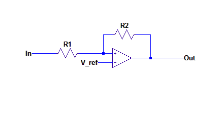

# Milestone 2: Wall Following
[Home](https://ece3400team19.github.io/)

## Team Tasks
  * Cynthia: Mounting Wall Sensors
  * Asena: Schmitt Trigger, Code debugging
  * Nonso: Schmitt Trigger debugging
  * Robert: Programming
  * Laasya: FFT integration, Code debugging


## Milestone Description
The goal of this milestone was to get our robot to successfully circle an arbitrary set of walls, avoid other robots, and follow lines.

## Milestone Materials
[3 wall sensors](https://www.sparkfun.com/products/12728) (GP2Y0A41SK0F)

## Part 1 - Hooking up the Wall Sensors
We connected the line sensor's three pins to ground, power, and an analog input (A2).
The line sensor outputs a voltage
Using the following code, we were able to detect how far away the sensor was from a wall.

```
void setup() {
    Serial.begin(9600);
  }

void loop() {
    float sensorValue = analogRead(A2); // Read sensor value for analog pin A2
    float dis = 2076/(sensorValue - 11); // convert to a distance

    if (dis < 4 || dis >30) {
        Serial.print( "Out of Range.\n");
    }
    else {
        Serial.print(dis);
        Serial.print(" cm\n");
    }
    delay(500);
}
```


Here is a video of the code in action. Laasya moves her hand farther away from the sensor until she is out of range, and then moves back into range.
<video width="640" height="360" controls muted>
  <source src="IMG_6671.MOV" type="video/mp4">
</video>

The Arduino only has 6 analog inputs. We were already using three analog inputs for the three line sensors we implemented in Milestone 1, and two analog inputs for the microphone detection and IR detection.
This only left us one analog input. We decided to change the analog output from the wall sensor into a digital output that could be read by the Arduino's digital pins. We did this using a Schmitt Trigger. None of us had made a Scmitt Trigger before, so we found a [calculator](https://www.random-science-tools.com/electronics/schmitt-trigger-calculator.htm) online.

We decided on a low threshold of 0.56 V and a high threshold of 1.09 V. We chose an output voltage low of 0V and high of 3.5V.
The low threshold corresponds to when the wall sensor is 20 cm away from an object, and the high threshold corresponds to when the wall sensor is 10 cm away from an object. These inputs to the schmitt trigger calculator gave us that R2 = 1.51 kΩ, R1 = 10 kΩ, and Vref = 0.94.

 

 We built this circuit and tested it by putting input voltages from a DC voltage source and checking the output with an oscilloscope. The output voltages were as expected: when we increased the voltage source slowly from 0 -> 1V, we stayed at an output voltage of around 0 until suddenly we got an output of 3.5V for an input of 1V. Then, we decreased the voltage source slowly from 1V-> 0.5V. We stayed at a high output voltage until we got an output of 0V for an input of 0.5V. Then, we tested that the wall sensor gave us a voltage of 1V or greater when we put an object close to it, and a voltage of .5V or less when an object was far away.
 However, when we put the wall sensor as the input of our schmitt trigger, nothing worked! The output stayed high (3.5V) forever. With the help of multiple TAs, we figured out that our resistor values were too small. The ratio of R2/R1 is what matters, so we switched R2 from 1.5kΩ to 15kΩ and R1 from 10kΩ to 100kΩ. We kept Vref the same. Then, our schmitt trigger worked as expected using the wall sensor as an input.

## Part 2 - Avoiding Walls
After successfully building a Schmitt Trigger circuit, we built two more so that we would have one for every wall sensor. We connected the output of every Schmitt trigger to a digital pin on the Arduino. The digital pins read high when there was a wall in front of the sensor and low when nothing was within 20cm of the sensor. We verified the output of the wall sensors with the following method:
```
int lw = 6;
int fw = 7;
int rw = 8;

void checkWallSensors(){
  Serial.print("left wall : ");
  Serial.print(digitalRead(lw));
  Serial.print(" front wall : ");
  Serial.print(digitalRead(fw));
  Serial.print(" right wall : ");
  Serial.print(digitalRead(rw));
  Serial.println();
  delay(50);
}
```
After verifying the output of the Serial monitor, we attached three external LEDs to our Arduino, each LED corresponded to one of the wall sensors and we programmed each LED to turn on when its corresponding wall sensor detected a wall.

## Part 3 - Avoiding Walls while Staying on the Line
We took our line following code from Milestone1 and added logic to avoid walls. We originally added logic for avoiding robots as well, but took this part out because we found out that the FFT library and the servos use the same timer, which causes nothing to work.
We will attach the final code at the end, but for now, we will discuss how we avoided walls. When we are not at an intersection, we just follow the line using our logic from Milestone1. When we reach an intersection, we check our surroundings. If there is no wall in front of us, we go straight. If there is a wall in front and on one of the sides, we turn towards the side without a wall. If there is only a wall in the front, we turn left. If there is a wall in every direction, we turn around.

## Part 3 - Avoiding Walls while Staying on the Line and Avoiding Robots
The FFT library and servos use the same timer which causes the servos to not run. The issue is that to run the FFT, you need to change the values of some registers (TIMSK0, ADCSRA, ADMUX, DIDR0). We worked around this by saving the default values of these registers before they are altered and then resetting them after the FFT is run.
Our logic for avoiding walls while staying on the line and avoiding robots:
If the robot is not at an intersection, then follow the line.
If the robot is at an intersection, check your surroundings.
If the robot can go forward without hitting a wall or another robot, go forward.
If the robot can't go forward, but it can go left, turn left.
If the robot can't go forward or left, but can go right, turn right.
If the robot can't go forward, left, or right, turn around. 
